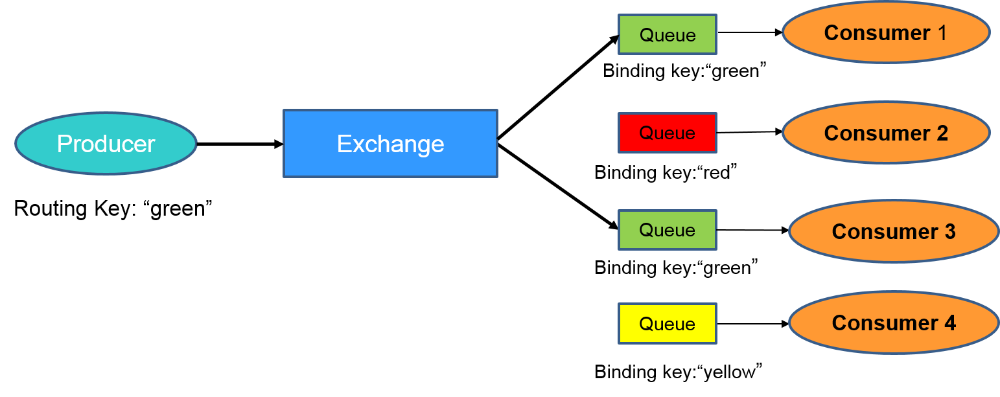
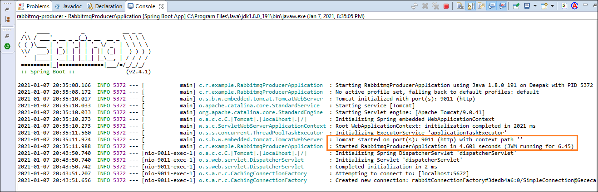
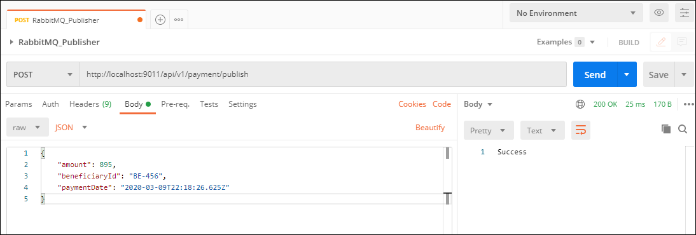
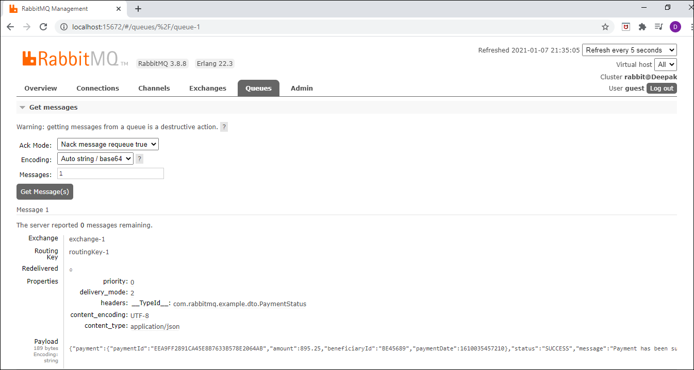
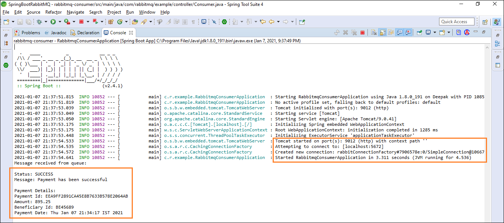

## springboot-rabbitmq-producer-consumer
This is a test project for demonstrating producer and consumer of messages using RabbitMQ and Sprint Boot

Please refer below official site of rabbitmq for details:

https://www.rabbitmq.com/getstarted.html

Lets use an example to understand how it works. Consider an example where there are four consumers (Consumer 1 - 4) interested in receiving messages matching the pattern “green”, “red” or “yellow”. In this example, we are using a direct exchange that will route the messages to the queues only when there is an exact match of the routing key of the message with the binding key of the queues. Each of the consumers declare a queue and bind the queue to the exchange with a binding key of interest. Lastly, we have a producer that is continuously sending messages to exchange with routing key “green”. The exchange will check for an exact match and route the messages to only Consumer 1 and Consumer 3.

## RabbitMQ Installation in Windows

1.	Download and install ERlang http://erlang.org/download/otp_win64_22.3.exe
2.	Downlaod and install RabbitMQ https://github.com/rabbitmq/rabbitmq-server/releases/download/v3.8.8/rabbitmq-server-3.8.8.exe
3.	Go to RabbitMQ Server install Directory C:\Program Files\RabbitMQ Server\rabbitmq_server-3.8.3\sbin
4.	Run command rabbitmq-plugins enable rabbitmq_management
5.	Open browser and enter http://localhost:15672/ to redirect to RabbitMQ Dashboard
6.	Also we can Open it with IP Address http://127.0.0.1:15672
7.	Login page default username and password is guest
8.	After successfully login you should see RabbitMQ Home page

## RabbitMQ Dashboard

## Start the rabbitmq-producer application

## Publishing Messages to RabbitMQ Publisher API via Postman

## Published Message in the RabbitMQ Queue

## Start the rabbitmq-consumer application & message received

