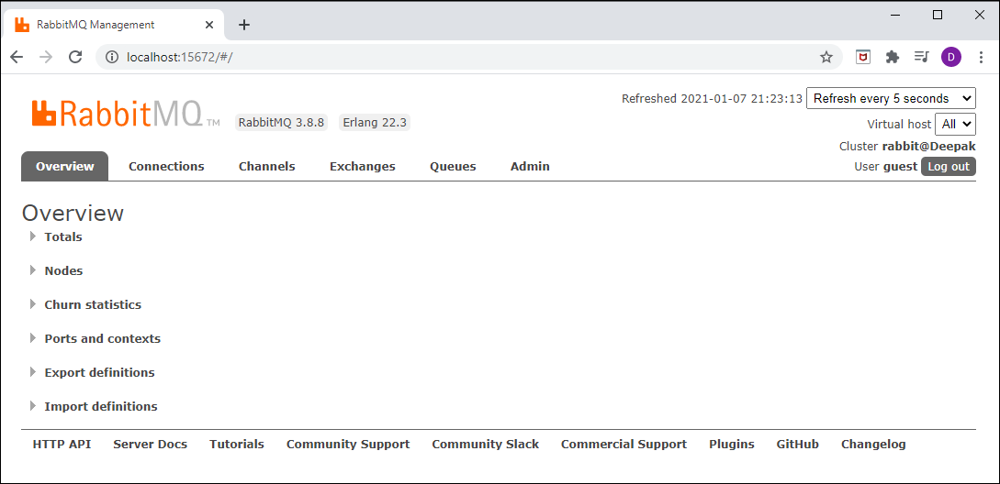

## springboot-rabbitmq-producer-consumer
Test project for demonstrating producer and consumer of messages using RabbitMQ and Sprint Boot

RabbitMQ is the most popular messaging library with over 35,000 production deployments. It is highly scalable, easy to deploy, runs on many operating systems and cloud environments. It supports many kinds of distributed deployment methodologies such as clusters, federation and shovels.

RabbitMQ uses Advanced Message Queueing Protocol (AMQP) and works on the basic producer consumer model. A consumer is a program that consumes/receives messages and producer is a program that sends the messages. Following are some important definitions that we need to know before we proceed.

Queue - Queues can be considered like a post box that stores messages until consumed by the consumer. Each consumer must create a queue to receives messages that it is interested in receiving. We can set properties to the queue during it’s declaration. The queue properties are:

* Name - Name of the queue
* Durable - Flag to indicate if the queue should survive broker restart.
* Exclusive - Used only for one connection and it will be removed when connection is closed.
* Auto-queue - Flag to indicate if auto-delete is needed. The queue is deleted when last consumer un-subscribes from it.
* Arguments - Optional, can be used to set message TTL (Time To Live), queue limit etc.

Bindings - Consumers bind the queue to an exchange with binding keys or routing patterns. Producers send messages and associate them with a routing key. Messages are routed to one or many queues based on a pattern matching between a message routing key and binding key.

Exchanges - Exchanges are entities that are responsible for routing messages to the queues based on the routing pattern/binding key used. They look at the routing key in the message when deciding how to route messages to queues. There are different types of exchanges and one must choose the type of exchange depending on the application design requirements

Fanout - It blindly broadcasts the message it receives to all the queues it knows.

Direct - Here, the message is routed to a queue if the routing key of the message exactly matches the binding key of the queue.

Topic - Here, the message is routed to a queue based on pattern matching of the routing key with the binding key. The binding key and the routing key pattern must be a list of words delimited by dots, for example, “car.subaru.outback” or “car.subaru.*”, “car.#”. A message sent with a particular routing key will be delivered to all the queues that are bound with a matching binding key with some special rules as

‘*’ (star) - can match exactly one word in that position. ‘#’ (hash) - can match zero or more words

Headers - If we need more complex matching then we can add a header to the message with all the attributes set to the values that need to be matched. The message is considered matching if the values of the attributes in the header is equal to that of the binding. The Header exchange ignores the routing key.

We can set some properties of the exchange during it’s declaration.

* Name - Name of the exchange
* Durable - Flag to indicate if the exchange should survive broker restart.
* Auto-delete - Flag indicates if auto-delete is needed. If set to true, the exchange is deleted when the last queue is unbound from it.
* Arguments - Optional, used by plugins and broker-specific features

Lets use an example to understand how they all fit together. Consider an example where there are four consumers (Consumer 1 - 4) interested in receiving messages matching the pattern “green”, “red” or “yellow”. In this example, we are using a direct exchange that will route the messages to the queues only when there is an exact match of the routing key of the message with the binding key of the queues. Each of the consumers declare a queue and bind the queue to the exchange with a binding key of interest. Lastly, we have a producer that is continuously sending messages to exchange with routing key “green”. The exchange will check for an exact match and route the messages to only Consumer 1 and Consumer 3.

## RabbitMQ Installation in Windows

1.	Download and install ERlang http://erlang.org/download/otp_win64_22.3.exe
2.	Downlaod and install RabbitMQ https://github.com/rabbitmq/rabbitmq-server/releases/download/v3.8.8/rabbitmq-server-3.8.8.exe
3.	Go to RabbitMQ Server install Directory C:\Program Files\RabbitMQ Server\rabbitmq_server-3.8.3\sbin
4.	Run command rabbitmq-plugins enable rabbitmq_management
5.	Open browser and enter http://localhost:15672/ to redirect to RabbitMQ Dashboard
6.	Also we can Open it with IP Address http://127.0.0.1:15672
7.	Login page default username and password is guest
8.	After successfully login you should see RabbitMQ Home page

## RabbitMQ Dashboard

## Start the rabbitmq-producer application

## Publishing Messages to RabbitMQ Publisher API via Postman

## Published Message in the RabbitMQ Queue

## Start the rabbitmq-consumer application & message received

